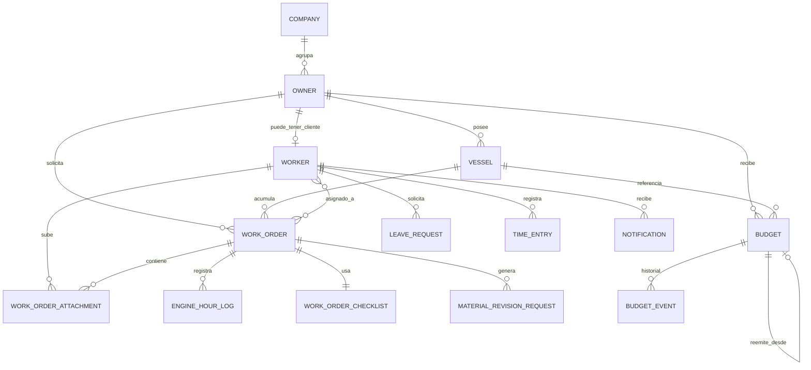

# Modelo relacional

## Motor y estrategia

- Desarrollo: H2 en memoria con modo compatible PostgreSQL.
- Produccion: PostgreSQL.
- Configuracion: `application.yml` para desarrollo y
  `application-postgres.yml` para produccion.
- Ajustes de esquema PostgreSQL: `db/postgres-startup-schema.sql`.

## Justificacion del modelo

El dominio esta centrado en relaciones de negocio claras:

- un propietario puede tener varias embarcaciones;
- una embarcacion puede acumular muchos partes;
- un parte puede tener varios trabajadores asignados;
- un trabajador puede registrar muchos fichajes y ausencias;
- un parte puede tener muchos adjuntos y un checklist asociado;
- un presupuesto puede generar eventos historicos y reemisiones.

Esto hace que un modelo relacional sea adecuado porque:

- garantiza integridad referencial;
- representa bien relaciones uno a muchos y muchos a muchos;
- facilita consultas historicas y filtros cruzados;
- permite transacciones consistentes en operaciones de negocio.

## Diagrama simplificado

## Detalles relevantes

- La relacion `work_orders` <-> `workers` es muchos a muchos mediante la tabla
  intermedia `work_order_workers`.
- Los adjuntos del parte guardan FK al parte y al usuario que los subio.
- Las ausencias y fichajes se relacionan con `workers` mediante `ManyToOne`.
- El checklist del parte se modela como `OneToOne`.
- El historico de presupuesto se separa en `budget_events` para no mezclar el
  estado actual con la auditoria temporal.

## Decisiones de modelado a justificar

- Los binarios no se guardan como BLOB en la BD; se guardan fuera y la BD
  conserva metadatos y referencias.
- Algunos datos compuestos de `Vessel` se almacenan como listas serializadas en
  columnas de texto con separador. No es la forma mas normalizada, pero reduce
  complejidad para un caso acotado de etiquetas y numeros de serie.
- El borrado de propietarios y embarcaciones pasa a archivado cuando existe
  historial, para no romper trazabilidad.

## Defensa para la memoria

El modelo relacional se ha disenado para conservar trazabilidad, historial y
consistencia. Se normalizan las relaciones nucleares del dominio y se reserva el
acceso por fichero para documentos y multimedia, que no encajan bien como datos
tabulares.
