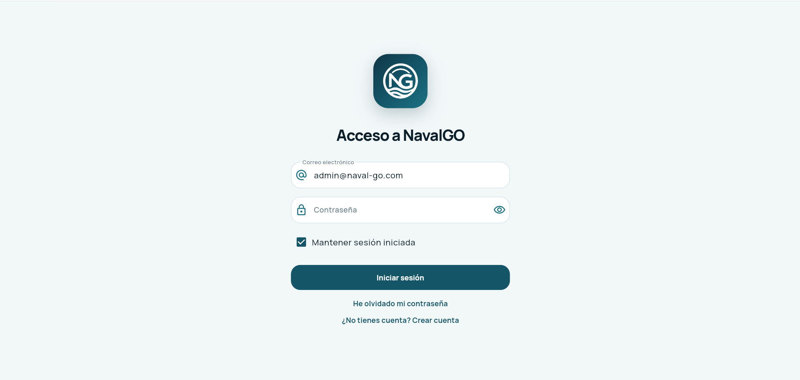
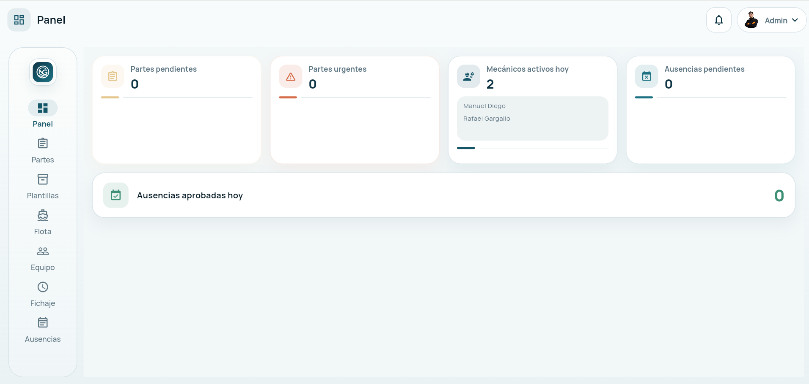
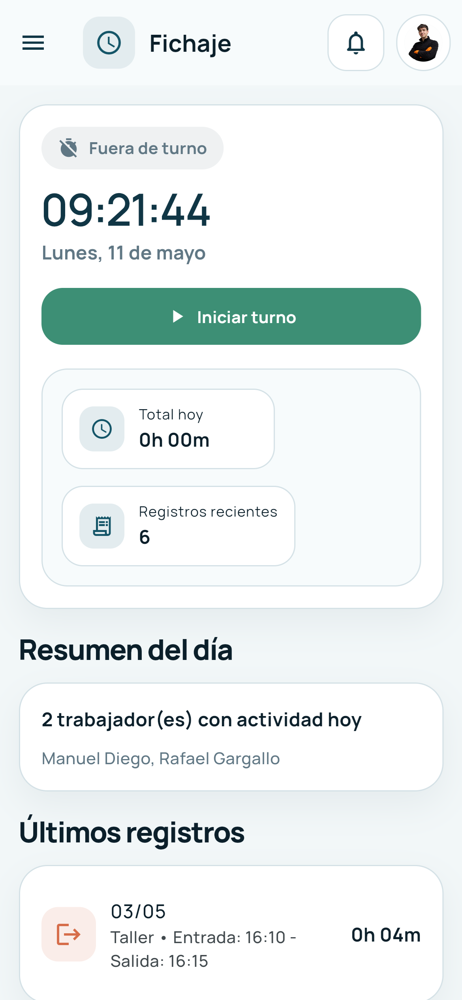
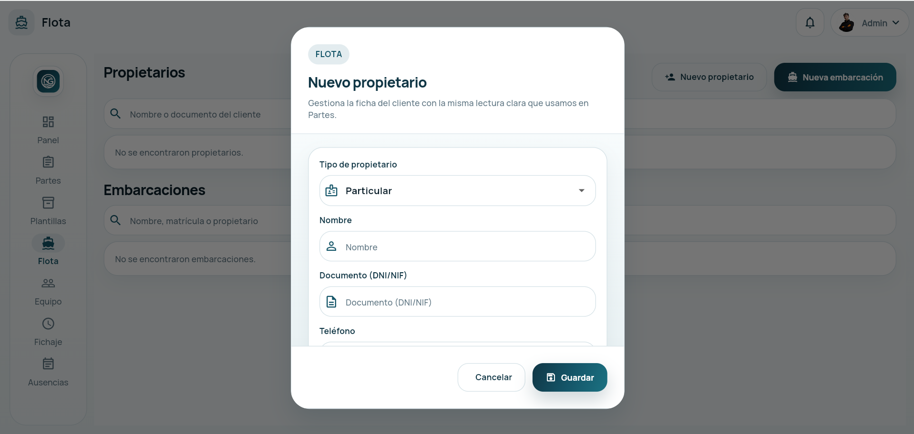

# Manual de Usuario Integral NavalGO

Version: 2026-05-18  
Producto: NavalGO  
Destino: usuarios finales, responsables de operativa, administracion y cliente final  
Formato recomendado de exportacion: PDF A4 con tabla de contenidos  

---

## Portada

NavalGO es una plataforma de gestion naval orientada a la coordinacion diaria de operativas, control horario, partes de trabajo, flota, presupuestos, ausencias, evidencias y firmas.  

Este manual reune en un unico documento la operativa principal de la aplicacion segun el rol de acceso:

- administrador;
- trabajador de taller o tecnico;
- comercial;
- cliente.

La intencion de este manual es servir como guia de uso real, no solo como resumen funcional. Por eso combina:

- explicacion de pantallas;
- pasos de uso;
- recomendaciones practicas;
- criterios de trabajo diario;
- pautas de revision y control.

Si se exporta a PDF con portada, tabla de contenidos e imagenes, este documento esta pensado para ocupar aproximadamente entre 30 y 40 paginas.

---

## Indice

1. Introduccion
2. Que es NavalGO
3. Perfiles de usuario
4. Requisitos basicos de uso
5. Acceso a la aplicacion
6. Inicio de sesion
7. Recuperacion de contrasena
8. Cambio obligatorio de contrasena
9. Navegacion general
10. Elementos comunes de la interfaz
11. Notificaciones internas
12. Area de administrador
13. Panel del administrador
14. Partes de trabajo
15. Plantillas de material
16. Flota
17. Equipo
18. Control horario global
19. Ajuste individual de jornada
20. Ausencias y vacaciones
21. Area de trabajador
22. Inicio del trabajador
23. Partes asignados al trabajador
24. Fichaje diario
25. Solicitudes de ajuste de fichaje
26. Ausencias del trabajador
27. Area comercial
28. Inicio comercial
29. Presupuestos
30. Flota en area comercial
31. Fichaje y ausencias del comercial
32. Area cliente
33. Inicio del cliente
34. Embarcaciones del cliente
35. Presupuestos del cliente
36. Cuenta del cliente
37. Buenas practicas de uso
38. Preparacion para inspecciones o revisiones internas
39. Preguntas frecuentes
40. Cierre

---

## 1. Introduccion

NavalGO centraliza en una sola aplicacion procesos que normalmente quedan repartidos en mensajes, hojas sueltas, documentos PDF, llamadas y herramientas inconexas.  

En lugar de trabajar con informacion dispersa, NavalGO organiza la operativa en modulos conectados:

- acceso por rol;
- registro de jornada;
- partes de trabajo;
- asignacion de personal;
- embarcaciones y propietarios;
- presupuestos;
- ausencias;
- firma y evidencia.

Cada perfil entra a un area distinta segun su funcion. Esto reduce ruido, limita errores y deja trazabilidad de las acciones realizadas.

Este manual esta redactado para usuarios no tecnicos. Cuando aparece alguna referencia al sistema, se explica desde el punto de vista de uso, no desde el punto de vista del desarrollo.

---

## 2. Que es NavalGO

NavalGO es una plataforma de gestion naval pensada para empresas que necesitan controlar:

- trabajos realizados sobre embarcaciones;
- horas trabajadas;
- desplazamientos y actividad diaria;
- personal y permisos;
- clientes, propietarios y flota;
- presupuestos comerciales;
- ausencias y vacaciones;
- cierre firmado y evidencia de trabajos.

El sistema esta preparado para funcionar en web y en dispositivos moviles. La experiencia de uso cambia ligeramente segun el ancho disponible, pero las funciones principales se mantienen.

Casos de uso habituales:

- un trabajador inicia y cierra su jornada;
- un tecnico completa un parte y adjunta fotos;
- un administrador revisa incidencias del control horario;
- un comercial crea y envia un presupuesto;
- un cliente consulta presupuestos y embarcaciones vinculadas;
- un responsable revisa ausencias pendientes.

---

## 3. Perfiles de usuario

NavalGO organiza el acceso por roles.

### 3.1 Administrador

El administrador dispone de la mayor capacidad operativa. Puede:

- ver el panel general;
- gestionar partes;
- crear y editar plantillas;
- gestionar propietarios y embarcaciones;
- gestionar equipo y permisos;
- revisar el control horario global;
- registrar jornadas manuales;
- revisar solicitudes de ajuste;
- gestionar ausencias.

### 3.2 Trabajador

El trabajador usa la app para:

- consultar su resumen diario;
- revisar partes asignados;
- fichar entrada y salida;
- pedir ajustes de fichaje;
- solicitar ausencias.

### 3.3 Comercial

El comercial utiliza la plataforma para:

- revisar su actividad;
- crear y seguir presupuestos;
- consultar flota;
- fichar su jornada;
- solicitar ausencias.

### 3.4 Cliente

El cliente accede a una zona mas simple, centrada en:

- resumen de actividad;
- consulta de embarcaciones;
- revision de presupuestos;
- gestion de su cuenta.

---

## 4. Requisitos basicos de uso

Para utilizar NavalGO con normalidad, se recomienda:

- conexion estable a internet;
- navegador actualizado si se usa version web;
- permisos de ubicacion activos si se va a fichar desde movil o navegador;
- cuenta activa con rol asignado;
- correo valido en caso de recuperacion o activacion.

Recomendaciones por dispositivo:

- en movil, mantener GPS o localizacion disponibles para el fichaje;
- en web, usar conexion segura HTTPS;
- para subida de evidencias, evitar redes inestables;
- para firmas, usar pantalla tactil o raton con precision suficiente.

---

## 5. Acceso a la aplicacion

El acceso comienza en la pantalla de login.

La app permite:

- iniciar sesion;
- recuperar contrasena;
- crear cuenta de cliente;
- recordar correo o sesion segun configuracion.

Flujo general:

1. Abrir la aplicacion.
2. Introducir correo electronico.
3. Introducir contrasena.
4. Elegir si se desea mantener sesion iniciada.
5. Pulsar `Iniciar sesion`.

Tras autenticarse, la app redirige automaticamente al area correcta segun el rol del usuario.

---

## 6. Inicio de sesion

La autenticacion es directa. El usuario no necesita elegir el tipo de acceso manualmente.

Campos visibles:

- correo electronico;
- contrasena;
- casilla `Mantener sesion iniciada`.

Acciones disponibles:

- `Iniciar sesion`;
- `He olvidado mi contrasena`;
- `No tienes cuenta? Crear cuenta`.

### 6.1 Que ocurre tras el acceso

Segun el rol, el sistema abre una shell distinta:

- administrador: panel de administracion;
- trabajador: panel operativo del trabajador;
- comercial: area comercial;
- cliente: area cliente.

### 6.2 Recordar sesion

La opcion de mantener sesion iniciada sirve para agilizar accesos repetidos.  

Conviene usarla solo en equipos de confianza.

No se recomienda activarla en:

- ordenadores compartidos;
- tablets comunes de empresa sin control de acceso;
- dispositivos ajenos;
- puestos de uso temporal.

---

## 7. Recuperacion de contrasena

Si el usuario no recuerda su clave:

1. Debe pulsar `He olvidado mi contrasena`.
2. Introducir su correo.
3. Seguir las instrucciones del sistema.

La recuperacion esta orientada a restaurar acceso sin depender de procesos manuales, siempre que la cuenta este correctamente registrada.

### 7.1 Casos habituales

- el usuario recuerda el correo pero no la contrasena;
- la cuenta fue creada hace tiempo y no se ha vuelto a usar;
- se ha producido un cambio de equipo o navegador.

### 7.2 Recomendacion

Tras recuperar acceso, se recomienda:

- elegir una contrasena robusta;
- no reutilizar contrasenas antiguas;
- guardar la clave en un gestor de contrasenas si la empresa lo permite.

---

## 8. Cambio obligatorio de contrasena

En algunos casos, el sistema obliga a cambiar la contrasena al entrar.

Esto ocurre, por ejemplo, cuando:

- la cuenta se ha generado con password temporal;
- se ha hecho un reseteo administrativo;
- la politica de acceso exige sustitucion inmediata de la clave.

La nueva contrasena debe cumplir reglas de seguridad:

- minimo 12 caracteres;
- incluir mayusculas;
- incluir minusculas;
- incluir numeros;
- incluir simbolos.

Mientras este cambio no se complete, el usuario no accede al area principal.

---

## 9. Navegacion general

La app utiliza contenedores principales por rol. Dentro de cada shell, las secciones se mantienen cargadas para facilitar el cambio rapido entre modulos.

### 9.1 En escritorio

La navegacion principal suele aparecer en lateral mediante `NavigationRail`.

### 9.2 En movil

Segun el rol y el ancho:

- trabajador: barra inferior;
- comercial: drawer o lateral compacto;
- cliente: drawer;
- administrador: drawer en movil y rail en escritorio.

### 9.3 Comportamiento esperado

- la pantalla principal no se pierde al cambiar de pestana;
- las secciones ya abiertas se conservan en memoria mientras dura la sesion;
- las pantallas secundarias se abren por navegacion interna y vuelven con el boton atras.

---

## 10. Elementos comunes de la interfaz

Aunque cada rol ve funciones distintas, hay elementos visuales comunes.

### 10.1 Cabecera

La cabecera suele incluir:

- nombre de seccion actual;
- icono de la seccion;
- acceso a notificaciones;
- acceso al menu de cuenta;
- foto de perfil si existe.

### 10.2 Menu de cuenta

Normalmente permite:

- abrir `Mi perfil`;
- cambiar contrasena;
- consultar privacidad y condiciones;
- cerrar sesion.

### 10.3 Paneles y tarjetas

NavalGO usa paneles visuales para:

- metricas;
- resumenes;
- incidencias;
- formularios;
- bloques de ayuda contextual.

### 10.4 Dialogos

Muchas acciones se hacen dentro de dialogos:

- crear registros;
- editar datos;
- confirmar borrados;
- asignar jornadas;
- aprobar o rechazar solicitudes.

---

## 11. Notificaciones internas

La aplicacion incorpora un panel de notificaciones internas.

Funciones disponibles:

- ver avisos nuevos;
- abrir una notificacion concreta;
- marcar todas como leidas;
- redirigir al modulo correspondiente segun el tipo de aviso.

Ejemplos de notificacion:

- parte pendiente;
- aviso de fichaje;
- ausencia pendiente;
- presupuesto;
- accion administrativa.

Esto permite llegar rapido al punto donde hay que actuar sin recorrer menus manualmente.

---

## 12. Area de administrador

El administrador entra en la zona con mas cobertura funcional del sistema.

Secciones disponibles actualmente:

- Panel;
- Partes;
- Plantillas;
- Flota;
- Equipo;
- Fichaje;
- Ausencias.

La vista de administrador esta pensada para coordinar operativa, negocio y supervision.

---

## 13. Panel del administrador

El panel administrativo muestra una lectura resumida del sistema.

Actualmente puede incluir bloques como:

- partes pendientes;
- partes urgentes;
- personal activo hoy;
- ausencias pendientes;
- ausencias aprobadas hoy;
- top 3 del equipo.

El ranking `Top 3 del equipo` mezcla comerciales y personal de taller en una misma clasificacion basada en puntuacion global.

Su funcion es:

- visualizar talento y constancia;
- reforzar cultura de rendimiento;
- crear competitividad sana;
- ocupar espacio operativo util en el dashboard.

En administrador, este panel debe leerse como una vista rapida. No sustituye a los modulos de detalle.

---

## 14. Partes de trabajo

El modulo de partes es una de las piezas principales del sistema.

Permite al administrador:

- crear nuevos partes;
- editar partes existentes;
- asignar trabajadores;
- vincular embarcacion;
- registrar descripcion y avance;
- introducir horas de trabajo;
- anotar horas de motor;
- subir adjuntos;
- revisar checklist;
- gestionar firma de trabajador;
- gestionar firma de cliente;
- cerrar el parte;
- exportar evidencia.

### 14.1 Cuando usar un parte

Se utiliza cuando una intervencion debe quedar documentada de forma formal.  

Ejemplos:

- mantenimiento;
- averia;
- servicio en desplazamiento;
- revision tecnica;
- trabajo recurrente sobre embarcacion.

### 14.2 Informacion habitual de un parte

Un parte puede contener:

- titulo o identificador;
- embarcacion;
- propietario;
- trabajadores asignados;
- prioridad;
- estado;
- descripcion;
- horas;
- materiales o checklist;
- archivos adjuntos;
- firmas.

### 14.3 Recomendaciones de uso

- no dejar descripciones ambiguas;
- adjuntar evidencias cuando el trabajo lo justifique;
- revisar horas antes del cierre;
- completar firmas si el flujo lo requiere;
- evitar cerrar partes incompletos salvo criterio justificado.

---

## 15. Plantillas de material

El administrador puede gestionar plantillas para revisiones o listas de comprobacion.

Estas plantillas sirven para:

- estandarizar controles;
- ahorrar tiempo;
- evitar olvidos;
- aplicar el mismo patron a trabajos similares.

Operaciones disponibles:

- crear plantilla;
- editar plantilla;
- borrar plantilla;
- reutilizarla en partes o revisiones.

Se recomienda crear plantillas especialmente para:

- comprobaciones recurrentes;
- revisiones previas a entrega;
- mantenimientos periodicos;
- control de material tecnico.

---

## 16. Flota

El modulo de flota centraliza propietarios y embarcaciones.

Acciones tipicas:

- crear propietario;
- editar propietario;
- crear embarcacion;
- editar embarcacion;
- revisar ficha tecnica;
- consultar horas de motor;
- ver partes asociados.

Utilidad real del modulo:

- evitar datos repetidos;
- vincular trabajos a embarcaciones concretas;
- dar contexto a presupuestos;
- consultar historico tecnico.

### 16.1 Buenas practicas

- mantener nombres consistentes;
- no duplicar propietarios;
- revisar identificacion de embarcacion antes de crear una nueva;
- completar campos tecnicos siempre que sea posible.

---

## 17. Equipo

Desde `Equipo`, el administrador controla las cuentas internas.

Funciones principales:

- crear usuarios;
- editar usuarios;
- activar o desactivar cuentas;
- resetear contrasenas;
- conceder permiso de edicion de partes;
- revisar rol;
- acceder al ajuste individual de jornada.

### 17.1 Roles posibles

- administrador;
- comercial;
- trabajador.

### 17.2 Alta de usuario

Para crear un usuario:

1. Entrar en `Equipo`.
2. Pulsar `Crear usuario`.
3. Introducir nombre, correo y datos basicos.
4. Elegir rol.
5. Definir permisos si aplica.
6. Guardar.

### 17.3 Desactivacion

Desactivar una cuenta impide su uso sin eliminar el historial.

Es recomendable cuando:

- una persona deja temporalmente de trabajar;
- se quiere bloquear acceso sin perder trazabilidad;
- se detecta una incidencia administrativa.

---

## 18. Control horario global

El modulo `Fichaje` del administrador ya no debe entenderse como la pantalla de un solo trabajador, sino como una vista global de inspeccion y control.

Objetivos:

- ver toda la plantilla desde una sola pantalla;
- detectar incidencias sin entrar uno por uno;
- consultar actividad relevante;
- revisar jornadas abiertas;
- ver cierres forzados;
- revisar ajustes pendientes;
- abrir detalle individual solo cuando haga falta.

### 18.1 Que muestra la vista global

La vista global puede incluir:

- total de trabajadores monitorizados;
- jornadas abiertas;
- ajustes pendientes;
- cierres forzados;
- trabajadores con incidencias;
- filtros de inspeccion;
- lista de eventos relevantes;
- resumen individual por trabajador.

### 18.2 Que no ensucia esta vista

Los autocierres normales por hora prevista no se destacan como incidencia.  

Esto significa que si un trabajador indico una hora de salida prevista y el sistema cerro la jornada de forma normal conforme a esa previson:

- no debe disparar alarma;
- no debe contaminar contadores;
- no debe ensuciar la lista de incidencias.

### 18.3 Para que sirve en inspecciones

Ante una inspeccion o revision interna, el administrador puede:

- localizar rapidamente jornadas abiertas;
- detectar cierres forzados;
- revisar ajustes pendientes;
- entrar solo en el trabajador que realmente necesita detalle.

---

## 19. Ajuste individual de jornada

Cuando desde el control global o desde equipo hace falta entrar en detalle de una persona concreta, se utiliza la pantalla individual de jornada.

Permite:

- ver insight del trabajador;
- revisar metricas;
- consultar su historico de jornadas;
- ajustar una jornada existente;
- registrar una jornada manual;
- aprobar o rechazar solicitudes de ajuste.

### 19.1 Registro manual de jornada

Esta funcion es util cuando un trabajador olvida fichar o cuando una incidencia obliga a regularizar datos.

Flujo:

1. Abrir el detalle del trabajador.
2. Pulsar `Registrar jornada manual`.
3. Introducir fecha, entrada, salida y tipo de jornada.
4. Guardar.

Se recomienda usar esta opcion solo cuando exista criterio claro y trazabilidad interna suficiente.

### 19.2 Ajuste de una jornada existente

Puede modificarse:

- hora de entrada;
- hora de salida;
- hora prevista;
- tipo de jornada.

Esto debe hacerse con cuidado para no alterar la lectura del historico sin motivo.

---

## 20. Ausencias y vacaciones

El administrador puede revisar solicitudes de ausencia y actuar sobre ellas.

Acciones habituales:

- ver solicitudes pendientes;
- aprobar o rechazar;
- revisar calendario;
- asignar ausencias manualmente;
- controlar ausencias no vacacionales.

### 20.1 Tipos de uso

El modulo sirve tanto para:

- vacaciones;
- bajas;
- permisos;
- incidencias de disponibilidad.

### 20.2 Criterios recomendados

- revisar fechas con cuidado;
- evitar solapes no controlados;
- confirmar que la persona correcta es la afectada;
- usar comentarios claros si se rechaza.

---

## 21. Area de trabajador

La zona de trabajador esta orientada a la operativa diaria y debe ser sencilla.

Secciones principales:

- Inicio;
- Partes;
- Fichaje;
- Ausencias.

La filosofia de este rol es:

- ver solo lo necesario;
- reducir pasos;
- facilitar fichaje y documentacion del trabajo.

---

## 22. Inicio del trabajador

El dashboard del trabajador muestra un resumen compacto.

Puede incluir:

- mis partes;
- urgentes;
- horas de hoy;
- vacaciones disponibles;
- top 3 del equipo.

El ranking aparece tambien para trabajadores y comerciales, con enfoque mobile first y sin romper la maquetacion en movil.

Su objetivo es:

- reforzar visibilidad del rendimiento;
- mantener cultura de equipo;
- mostrar clasificacion conjunta entre perfiles.

---

## 23. Partes asignados al trabajador

Desde `Partes`, el trabajador consulta las tareas que le afectan.

Acciones habituales:

- abrir un parte;
- leer instrucciones;
- completar informacion operativa;
- adjuntar evidencias;
- revisar checklist;
- firmar cuando proceda.

### 23.1 Recomendaciones para el trabajador

- leer el parte antes de intervenir;
- subir fotos claras;
- no dejar campos criticos sin revisar;
- comprobar que la firma corresponde al paso correcto;
- consultar con administracion si hay datos incoherentes.

---

## 24. Fichaje diario

El fichaje diario es uno de los flujos mas importantes.

### 24.1 Iniciar jornada

Pasos habituales:

1. Entrar en `Fichaje`.
2. Pulsar `Iniciar turno` o equivalente.
3. Elegir tipo de jornada.
4. Definir hora prevista de cierre si se conoce.
5. Permitir ubicacion.
6. Confirmar inicio.

### 24.2 Tipos de jornada

Trabajador:

- taller;
- viaje.

Comercial:

- oficina;
- en algunos contextos equivalentes de operativa segun configuracion.

### 24.3 Cerrar jornada

Para cerrar:

1. Volver a la pantalla de fichaje.
2. Pulsar `Finalizar turno`.
3. Confirmar.

### 24.4 Historial

La pantalla muestra registros recientes con:

- fecha;
- entrada;
- salida;
- tipo de jornada;
- posibles estados del registro.

### 24.5 Recordatorios y autocierres

El sistema puede emitir recordatorios de cierre.  

Ademas:

- los autocierres normales por hora prevista no se consideran incidencia visual importante;
- los cierres forzados por incumplimiento del cierre manual si se consideran relevantes para administracion.

---

## 25. Solicitudes de ajuste de fichaje

Si el trabajador detecta un error en su registro, puede pedir un ajuste.

### 25.1 Casos tipicos

- olvido de cerrar;
- hora de entrada mal registrada;
- salida no guardada;
- jornada imputada con datos incompletos;
- incidencia de ubicacion o contexto.

### 25.2 Flujo

1. Entrar en `Fichaje`.
2. Abrir `Solicitar ajuste`.
3. Seleccionar jornada o fecha.
4. Introducir horas correctas.
5. Explicar el motivo.
6. Enviar.

### 25.3 Estados posibles

- pendiente;
- aprobada;
- rechazada.

El trabajador puede revisar sus solicitudes desde el propio modulo.

---

## 26. Ausencias del trabajador

El trabajador puede crear y revisar solicitudes.

Flujo basico:

1. Entrar en `Ausencias`.
2. Elegir fecha de inicio y fin.
3. Escribir motivo si procede.
4. Guardar la solicitud.

Despues podra ver el estado.

### 26.1 Recomendacion

No conviene usar una solicitud confusa o demasiado generica si la ausencia requiere validacion administrativa posterior.

---

## 27. Area comercial

El comercial comparte algunos flujos con trabajador, pero su foco principal es negocio y seguimiento de presupuestos.

Secciones:

- Inicio;
- Presupuestos;
- Flota;
- Fichaje;
- Ausencias.

---

## 28. Inicio comercial

El dashboard comercial reutiliza el panel compartido y muestra:

- presupuestos totales;
- pendientes de respuesta;
- ultimos presupuestos;
- horas de hoy;
- vacaciones;
- top 3 del equipo.

Esto permite que el comercial vea su actividad propia y, al mismo tiempo, el ranking comun.

---

## 29. Presupuestos

El modulo de presupuestos sirve para crear, revisar y hacer seguimiento de propuestas.

Acciones habituales:

- crear borrador;
- editar borrador;
- asociar embarcacion;
- adjuntar o previsualizar PDF;
- enviar al cliente;
- revisar estado.

### 29.1 Estados tipicos

- borrador;
- enviado;
- aceptado;
- rechazado;
- cancelado.

### 29.2 Flujo recomendado

1. Crear borrador con datos claros.
2. Revisar importe y contenido.
3. Asociar correctamente la embarcacion.
4. Previsualizar el PDF.
5. Enviar al cliente.
6. Hacer seguimiento posterior.

### 29.3 Buenas practicas

- no enviar borradores incompletos;
- revisar nombres de embarcacion y cliente;
- dejar el PDF limpio y presentable;
- comprobar que el estado cambia correctamente tras el envio.

---

## 30. Flota en area comercial

El comercial puede consultar flota y contexto de embarcaciones para preparar mejor propuestas y seguimiento.

Usos frecuentes:

- verificar a que propietario pertenece una embarcacion;
- revisar el nombre y ficha basica;
- confirmar contexto antes de emitir presupuesto.

---

## 31. Fichaje y ausencias del comercial

El comercial utiliza los mismos principios base que un trabajador:

- fichaje de entrada;
- fijacion opcional de hora prevista;
- cierre de jornada;
- solicitud de ajuste;
- solicitud de ausencias.

La diferencia principal es el contexto de trabajo, no la mecanica general de uso.

---

## 32. Area cliente

La zona cliente esta simplificada. Se centra en visibilidad y respuesta, no en operativa interna.

Secciones:

- Inicio;
- Flota;
- Presupuestos;
- Cuenta.

---

## 33. Inicio del cliente

El cliente ve un dashboard breve.

Objetivos:

- destacar presupuestos pendientes;
- resumir presupuestos aceptados y totales;
- facilitar acceso directo a revision.

El panel puede destacar especialmente un presupuesto pendiente cuando exista.

---

## 34. Embarcaciones del cliente

Desde flota, el cliente puede consultar las embarcaciones asociadas a su cuenta.

Esto permite:

- verificar relacion con la empresa;
- mantener visibilidad sobre los activos vinculados;
- dar contexto a presupuestos y trabajos relacionados.

---

## 35. Presupuestos del cliente

En esta seccion el cliente:

- revisa presupuestos enviados;
- abre vista previa;
- descarga PDF si corresponde;
- consulta estado historico.

### 35.1 Uso recomendado del cliente

- revisar importes y condiciones con calma;
- comprobar que la embarcacion es la correcta;
- responder o continuar segun proceso interno de la empresa.

---

## 36. Cuenta del cliente

El cliente puede gestionar datos de cuenta y cerrar sesion.

Este modulo es mas reducido que el de usuarios internos, porque el perfil cliente esta centrado en acceso y consulta.

---

## 37. Buenas practicas de uso

Para obtener el maximo rendimiento de NavalGO:

- usar nombres consistentes;
- no duplicar registros innecesarios;
- cerrar jornadas correctamente;
- completar partes con rigor;
- adjuntar evidencia cuando corresponda;
- revisar presupuestos antes de enviar;
- mantener actualizada la flota;
- no compartir contrasenas.

Buenas practicas para fichaje:

- fichar al iniciar realmente la jornada;
- definir hora prevista si se conoce;
- cerrar manualmente al terminar;
- pedir ajuste si hubo error real.

Buenas practicas para administracion:

- revisar incidencias del control horario con frecuencia;
- usar registros manuales solo cuando haga falta;
- mantener permisos de equipo actualizados;
- no mezclar datos operativos con pruebas innecesarias.

---

## 38. Preparacion para inspecciones o revisiones internas

NavalGO facilita la preparacion para inspecciones si se usa bien.

### 38.1 Que debe revisar un administrador

Antes de una inspeccion:

- abrir control horario global;
- revisar jornadas abiertas;
- revisar cierres forzados;
- revisar ajustes pendientes;
- comprobar regularizacion de incidencias;
- entrar al detalle solo donde sea necesario.

### 38.2 Que ayuda a nivel documental

El sistema tambien aporta valor porque conecta:

- fichajes;
- partes;
- horas;
- embarcaciones;
- firmas;
- evidencias;
- trazabilidad.

### 38.3 Criterio importante

No debe confundirse un autocierre normal por hora prevista con una incidencia real.  

La vista global ya esta pensada para evitar ese ruido y concentrarse en lo que requiere revision.

---

## 39. Preguntas frecuentes

### 39.1 No puedo iniciar sesion

Comprobar:

- correo correcto;
- contrasena correcta;
- cuenta activa;
- conexion a internet.

Si la cuenta fue reseteada, puede ser necesario cambiar la contrasena al entrar.

### 39.2 No me deja fichar

Posibles causas:

- falta de permiso de ubicacion;
- ya existe una jornada abierta;
- problema de conexion;
- datos de sesion no validos.

### 39.3 He olvidado cerrar la jornada

Lo correcto es:

- avisar si hace falta;
- pedir ajuste o esperar regularizacion administrativa segun procedimiento interno.

### 39.4 No veo una seccion que antes aparecia

Puede deberse a:

- cambio de rol;
- cambio de permisos;
- acceso con otra cuenta;
- sesion no actualizada.

### 39.5 Soy cliente y no veo mis presupuestos

Comprobar:

- que se ha iniciado sesion con la cuenta correcta;
- que el presupuesto ya fue enviado;
- que la asociacion con la embarcacion o cuenta cliente es correcta.

### 39.6 Soy comercial y no veo el ranking

El ranking se alimenta del resumen general del equipo. Si no aparece informacion suficiente puede deberse a falta de datos o a un entorno sin actividad suficiente todavia.

---

## 40. Cierre

NavalGO esta pensado para reducir friccion operativa y ganar trazabilidad.  

Su valor no esta en una sola pantalla, sino en la combinacion de modulos:

- acceso por rol;
- control horario;
- partes de trabajo;
- flota;
- presupuestos;
- ausencias;
- evidencias y firmas.

Este manual debe usarse como referencia principal para formacion interna, adopcion del sistema y apoyo a usuarios nuevos.

Si se quiere convertir en un documento formal de entrega o implantacion, se recomienda:

1. Exportarlo a PDF A4.
2. Mantener la tabla de contenidos.
3. Conservar las capturas principales.
4. Anadir portada con logo y version.
5. Revisar periodicamante el contenido segun evolucion del producto.

---

## Anexo A. Resumen rapido por rol

### Administrador

- Panel
- Partes
- Plantillas
- Flota
- Equipo
- Fichaje global
- Ausencias

### Trabajador

- Inicio
- Partes
- Fichaje
- Ausencias

### Comercial

- Inicio
- Presupuestos
- Flota
- Fichaje
- Ausencias

### Cliente

- Inicio
- Flota
- Presupuestos
- Cuenta

---

## Anexo B. Capturas recomendadas para acompanar este manual

Capturas ya disponibles en el proyecto:

- [Login Desktop](./capturas/Login-Desktop.png)
- [Login Mobile](./capturas/Login-Mobile.png)
- [Dashboard Desktop](./capturas/Dashboard-Desktop.png)
- [Dashboard Mobile](./capturas/Dashboard-Mobile.png)
- [Fichaje Desktop](./capturas/Fichaje-Desktop.png)
- [Fichaje Mobile](./capturas/Fichaje-Mobile.png)
- [Cliente Desktop](./capturas/Cliente-Desktop.png)
- [Cliente Mobile](./capturas/Cliente-Mobile.png)

Si quieres una version todavia mas presentable para entrega externa, lo ideal es complementar este manual con capturas de:

- partes;
- firma;
- ausencias;
- vista global de control horario;
- presupuestos.

