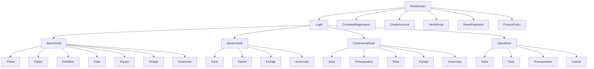

# Navegacion y flujo entre pantallas

## 1. Punto de entrada

La app decide la pantalla inicial en `lib/main.dart`:

- login normal;
- completar registro;
- crear cuenta;
- verificar email;
- reset de password;
- politica de privacidad.

## 2. Grafo de navegacion global

## 3. Navegacion principal por rol

### Administrador

- Desktop: `NavigationRail`.
- Movil: `NavigationBar`.
- Secciones persistentes con `IndexedStack`.

### Trabajador

- Desktop: `NavigationRail`.
- Movil: `NavigationBar`.
- Acceso directo a partes, fichaje y ausencias.

### Comercial

- Desktop: `NavigationRail`.
- Movil estrecho: `Drawer`.
- Modulos orientados a presupuestos y seguimiento comercial.

### Cliente

- Desktop: `NavigationRail`.
- Movil: `Drawer`.
- Entrada opcional a pestana de presupuestos usando parametro `screen=client-budgets`.

## 4. Boton atras y retorno

- Las pantallas secundarias usan `Navigator.push` y vuelven con el boton atras del sistema.
- Los dialogos y bottom sheets vuelven al estado anterior con `pop`.
- El cierre de sesion usa `pushReplacement` o `pushAndRemoveUntil` para impedir volver a pantallas privadas.

## 5. Paso de parametros

Ejemplos:

- `ClientShellScreen(initialIndex: ...)` para abrir una seccion concreta.
- `CompleteRegistrationScreen(token: ...)`.
- `VerifyEmailScreen(token: ...)`.
- `ResetPasswordScreen(token: ...)`.
- Pantallas y dialogos de partes que reciben ids o devuelven resultados por `Navigator.pop(result)`.

## 6. Navegacion desde notificaciones

Las notificaciones internas incluyen `actionRoute`. Cada shell traduce ese valor a una pestana:

- `PARTES`
- `FICHAJES`
- `AUSENCIAS`
- `PRESUPUESTOS`
- `PLANTILLAS`

Con esto la navegacion desde una alerta abre el modulo correcto sin reestructurar la app.
