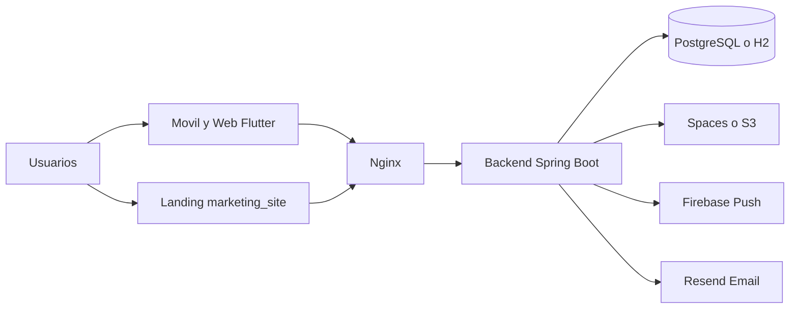
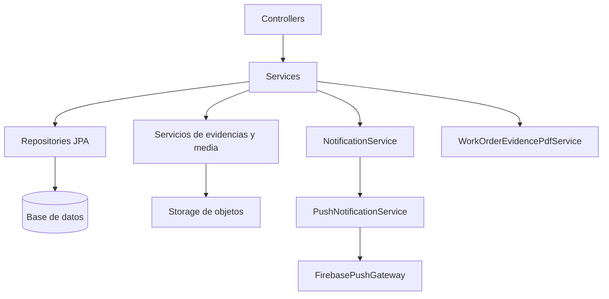
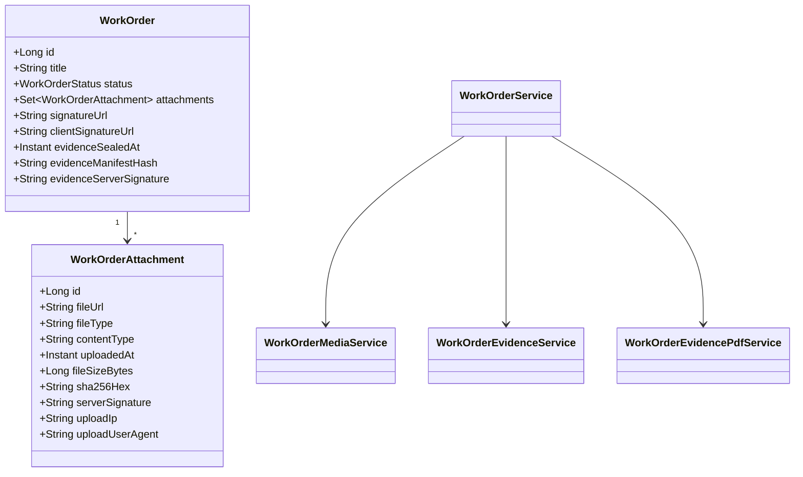
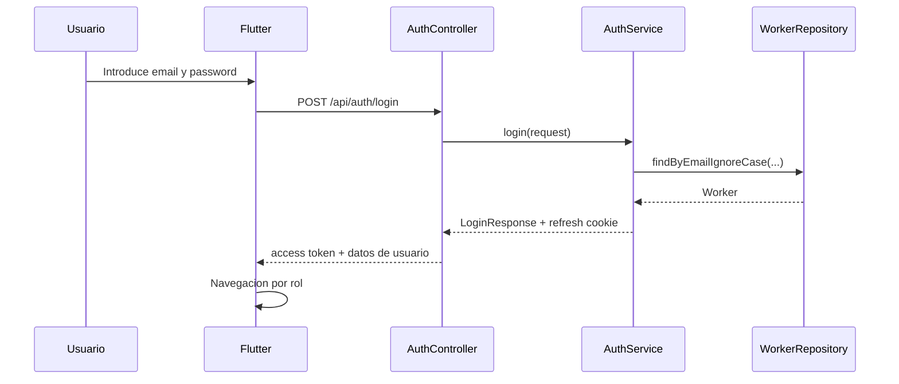
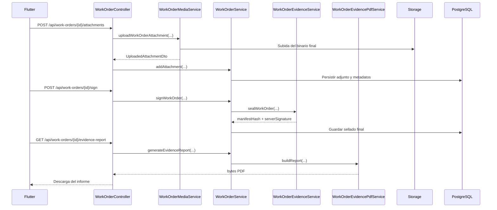

# Diagramas y flujos

## Diagrama de modulos

## Diagrama tecnico de backend

## Diagrama de clases simplificado de evidencias

## Flujo principal de autenticacion

## Flujo de parte con evidencia y exportacion

## Defensa para la memoria

Los diagramas muestran que el sistema no es un prototipo aislado: existe una
separacion clara entre cliente, API, persistencia, almacenamiento de objetos,
notificaciones y exportacion documental.
